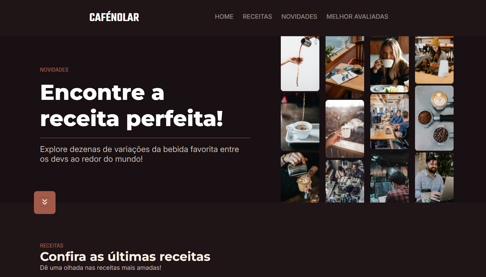
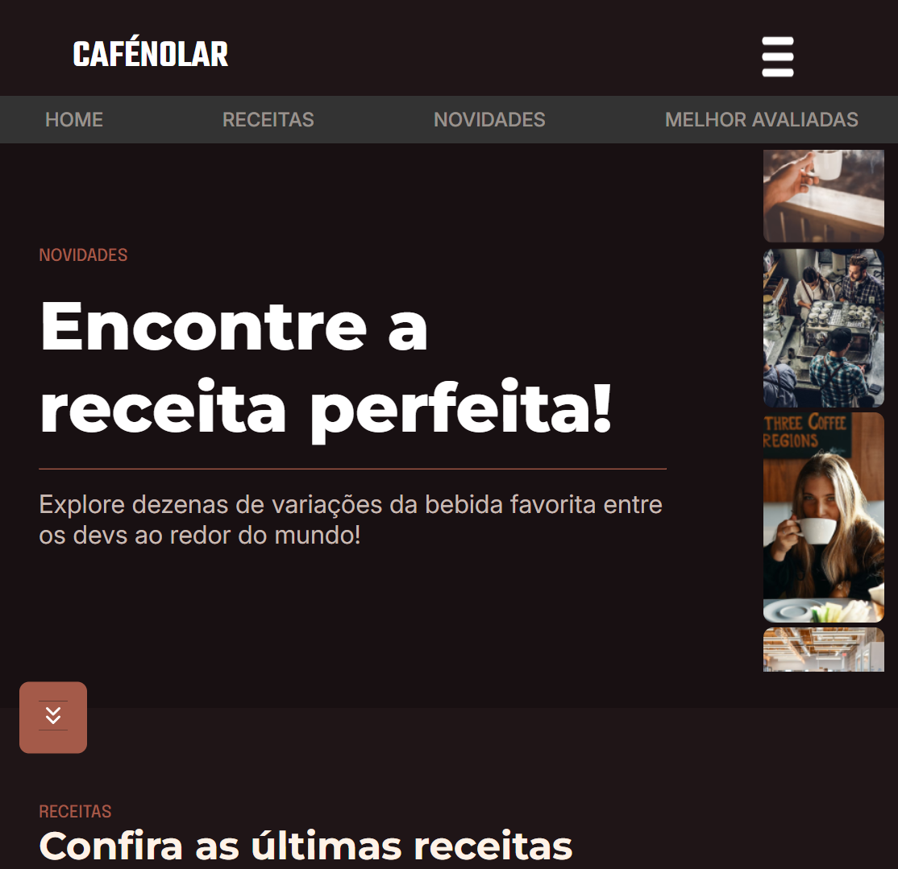

# Atividade CafenoLar
    Atividade feito em sala de aula utilizando HTML e CSS (e um tiquinho de javascript, cortesia da professora 😇) para criar uma página e estudar essas linguagens de programação

### Fotos do site pronto:

 